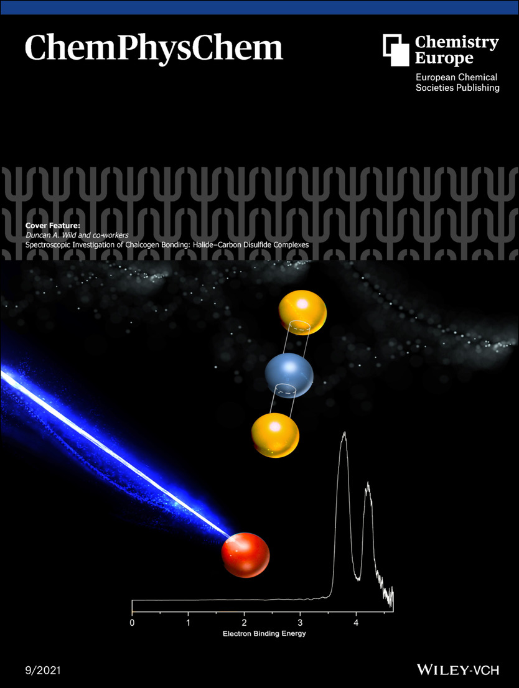

Big news coming out of ECU with the launch of the new Spectroscopy and Surface Science Research Facility!

<!--More-->

It was great to join collaborators and dignitaries at the
[launch of the new Spectroscopy and Surface Science Facility](https://www.ecu.edu.au/newsroom/articles/campus-and-community/ecu-launches-spectroscopy-and-surface-science-research-facility) at Edith Cowan University. Dr [Duncan Wild](https://watsonlaserlab.com/author/duncan-a.-wild/) is due to head up the spectroscopy arm of the facility, relocating his time-of-flight photoelectron spectrometer from UWA. This instrument (which Peter completed his PhD on).

