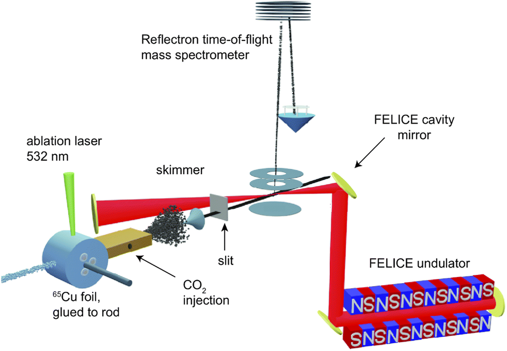

The Watson Laser Lab is proud to announce our successful bid for beamtime at the FELIX free-electron laser facility in Nijmegen, the Netherlands.

<!--More-->

Starting a new lab can be tricky. How do we keep up our output when ironing out all the kinks from dormant equipment can take anywhere from 3 months to a year? This is where central facilities like FELIX come in, allowing the Group to utilise existing apparatus for our research purposes while we develop our own techniques in parallel.

The Free-Electron Laser for IntraCavity Experiments (FELICE) is a unique experiment that combines both high intensity and highly tunable infrared light, with a laser vaporisation and metal clustering source. This allows for the both the generation and separation of atomically precise metal clusters, and their infrared spectroscopy via infrared photodissociation (IR-PD) techniques.

Previously, Peter has used this apparatus to study molecular activation of small gas molecules with metal clusters to further understand how active sites in metal catalysts enhance reactivity, as well as how metal clusters absorb light under these high fluence environments. In these upcoming experiments we hope to understand how small clusters and grains might play a role in generating the building blocks of organic life in extraterrestrial environments.