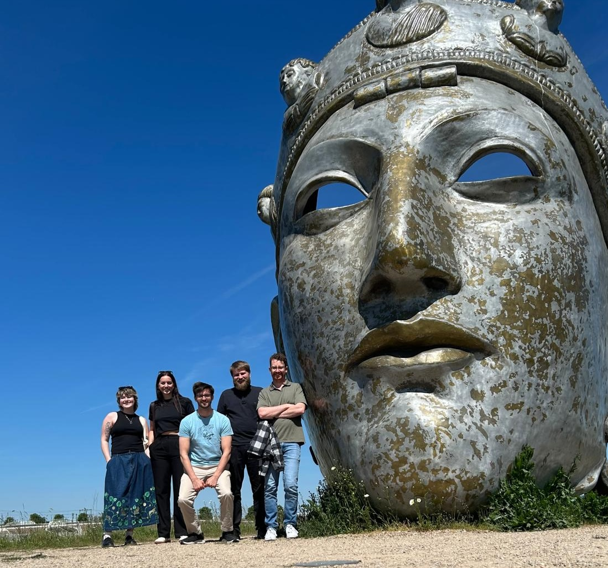

Peter, Neve and Cosi head to the Netherlands for 2 Weeks of Experiments!

<!--More-->

As part of our [successful FELIX beamtime application](https://watsonlaserlab.com/post/24-12-19-felix-beamtime/), the group travelled to Nijmegen in the Netherlands for a series of IRMPD experiments on astrochemically relevant metal clusters. This work is part of Honours students [Neve Annett](https://watsonlaserlab.com/author/neve-annett/) and [Cosima Biagioni's](https://watsonlaserlab.com/author/cosima-biagioni/) projects and the core experimental run of their years.

<figure style="max-width: 80%; margin: 20px auto; display: block;">
  
  <figcaption style="text-align: center; font-style: italic; margin-top: 5px;">
    The group with Christian and Peter at the "face of Nijmegen".
  </figcaption>
</figure>

The group was joined by Christian Haakansson and Peter Rubli from the Mackenzie Group at the University of Oxford and worked alongside the local team of Joost Bakker and his PhD student, Rutger Zijlstra..

<figure style="max-width: 80%; margin: 20px auto; display: block;">
  
  <figcaption style="text-align: center; font-style: italic; margin-top: 5px;">
    The group hard at work at FELIX alongside Rutger and Christian.
  </figcaption>
</figure>

In all it looks like we recorded all the data we had hoped for. It's looking promising for both Cosi and Neve's projects but also some future publications from the group. We were sadly interrupted by a fire alarm callout with about an hour to go in our final shift from what looked to be a rotary pump exhausting oil into the enclosed area they were stored (not our fault we swear!).

<figure style="max-width: 80%; margin: 20px auto; display: block;">
  
  <figcaption style="text-align: center; font-style: italic; margin-top: 5px;">
    Firefighters on-site at HFML-FELIX.
  </figcaption>
</figure>

