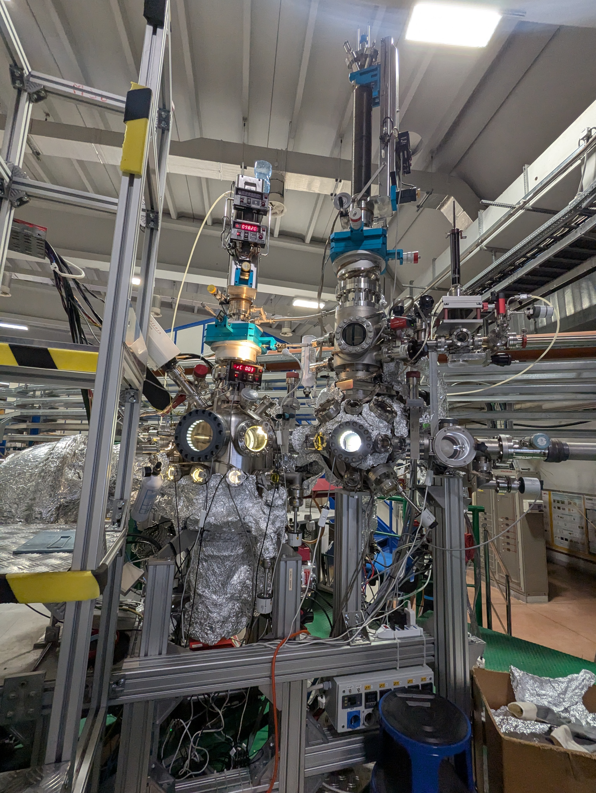
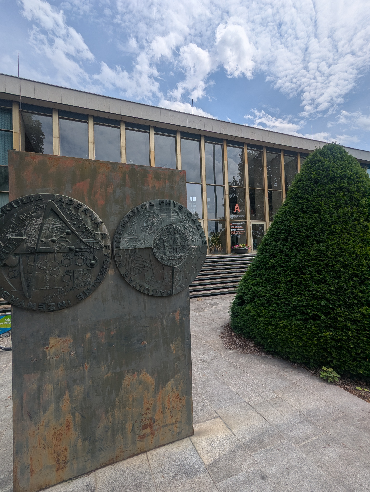

Honours Student Noah Corbett travelled to Europe for a new collaboration.

<!--More-->

As part of his training, Honours student [Noah Corbett](https://watsonlaserlab.com/author/noah-corbett/) travelled to the Europe to work with local beamline scientists, [Todd Martz](https://trmartz.scrippsprofiles.ucsd.edu/) from UC San Diego and [Prof. Roland De Marco](https://staffportal.curtin.edu.au/staff/profile/view/roland-de-marco-0dea6703/) on a project examining new materials as potential sea sensors.

<figure style="max-width: 80%; margin: 20px auto; display: block;">
  

    

      
    

    

      
    

  

  <figcaption style="text-align: center; font-style: italic; margin-top: 5px;">
    (left) End station at the Materials Science Beamline at the Elettra Synchrotron. (right) The Faculty of Mathematics and Physics building at Charles University, Prague.
  </figcaption>
</figure>

This work involved a combination of locations and techniques. Using the [Elettra Synchrotron Materials Beamline](https://www.elettra.eu/elettra-beamlines/material_science.html) in Trieste the team recorded near edge X-ray absorption fine structure (NEXAFS) spectra of these materials. Following this, Noah travelled to Charles University in Prague to use their High Resolution Field Emmision Scanning Electron Microscope (FESEM) and study the surface characteristics of the materials.

We're looking forward to the workup of this data and some exciting outputs!

