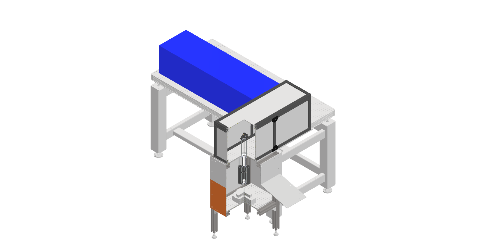

## Overview

Laser Ablation Synthesis in Solution (LASiS) is a physiochemical synthetic technique for the production of nanoparticles. By controlling the power and wavelength of the laser, composition of the solution or ablation medium, and the ablated material itself, high value materials can be produced without the production of chemical waste.

## Current Scope

LASiS is a mature technique, with a demonstrated scientific basis both overseas, and [within Curtin University by Prof. Mark Buntine](https://pubs.acs.org/doi/10.1021/jp9118315). However with the reduction of cost and increased capabilities of modern laser systems, there is the potential to produce high value materials at comparable scale to wet chemistry techniques.

Current work in the Watson Group involves the construction of a LASiS platform for nanoparticle production with support from the [Resources Technology and Critical Minerals Trailblazer](https://rtcm-trailblazer.au/) through their [Early Career Researcher Grant Program](https://watsonlaserlab.com/post/25-05-06-emcr-trailblazer/).

<figure style="max-width: 50%; margin: 20px auto; display: block;">
  
  <figcaption style="text-align: center; font-style: italic; margin-top: 5px;">
  </figcaption>
</figure>

We hope to commence nanoparticle production and the exploration of these methods in August 2025!

## Why LASiS?

(Describe differences)

As a photophysical synthesis process the tunability of LASiS is governed by the variability of the ablation system. This can include the wavelength of light used in the ablation process, the photon flux at the surface of the material, the temperature and by extension viscosity of the solvent used and the presence of salts in the solvent mixture. These parameters also differ depending on the ablation material and target size distribution.

<figure style="max-width: 100%; margin: 20px auto; display: block;">
  
  <figcaption style="text-align: center; font-style: italic; margin-top: 5px;">
    Current design of the LASiS setup currently under construction.
  </figcaption>
</figure>

## Research Team

This project involves the following team members:



## Collaborators

- [Prof. Mark Buntine](https://staffportal.curtin.edu.au/staff/profile/view/mark-buntine-b13d277f/)  
- [Prof. Zongping Shao](https://staffportal.curtin.edu.au/staff/profile/view/zongping-shao-0c4e5680/)
- [Dr. Xiaomin Xu](https://staffportal.curtin.edu.au/staff/profile/view/xiaomin-xu-23194b41/)
- [Dr. Jiayi Tang](https://scholar.google.com/citations?user=zSBOy40AAAAJ&hl=zh-CN)

## Contact

For more info, contact [peter@watsonlaserlab.com](mailto:peter@watsonlaserlab.com).