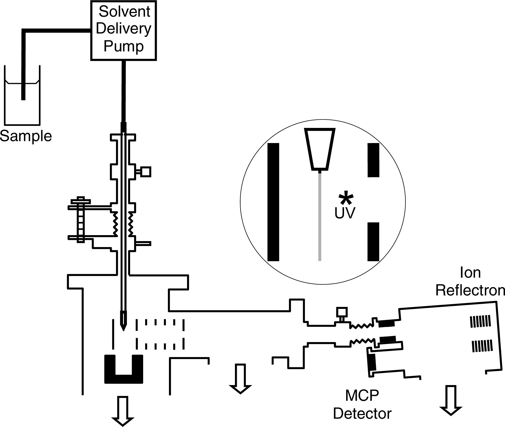
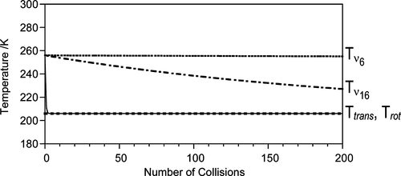

## Overview

How do molecules behave at and near the surface of liquids? If we think about the liquid like a crowd of jostling people, pushing through the crowd and out into space we might bounce or bump into people during our path.

Now if we imagine our liquid surface is that of a bubble or droplet, you might imagine ways in which molecules arrange themselves near the liquid surface. How might the characterisitcs of the surface effect the molecules passing across this interface?

Laser spectroscopy can answer some of these questions. By using well characterised molecules as probes we aim to understand how temperature changes at a molecular level under differing surface conditions. This research has direct impact on the role of aerosols on atmospheric reactivity of molecules but also potential applications in industrial surfactant design.

## Current Scope

Currently our goal is to recommission the liquid microjet spectrometer housed at Curtin University (a schematic is shown below). This will involve testing and maintenance of some old equipment, ensuring that the spectrometer operates, and upgrading components and data acquisition software.

<figure style="max-width: 80%; margin: 20px auto; display: block;">
  
  <figcaption style="text-align: center; font-style: italic; margin-top: 5px;">
    Schematic of the liquid microjet apparatus housed at Curtin University. (Image Credit: J. Phys. Chem. C 2009, 113, 2, 637-643)
  </figcaption>
</figure>

The spectrometer functions by pumping a solvent mixture into vacuum, forming a liquid jet about the width of a human hair. Dissolved molecules in this mixture can evaporate from the liquid surface and the amount of which is monitored by ionising them with a laser pulse of UV light. For well characterised molecules, by varying the photon energy we are able to fit the rovibrational manifolds of the evaporating molecules and determine temperatures for individual vibrations. An example of this concept was shown previously by Mark Buntine with benzene evaporating from a ethanol-water solvent mixture.

<figure style="max-width: 80%; margin: 20px auto; display: block;">
  
  <figcaption style="text-align: center; font-style: italic; margin-top: 5px;">
    Thermal energy partition between rotational, translational and vibrational motion of benzene evaporating from a liquid jet as a function of the number of collisions near the surface. (Image Credit: J. Phys. Chem. C 2009, 113, 2, 637-643)
  </figcaption>
</figure>

## Current Students
This project is currently accepting applications in the current Research Traing Program (RTP) round. Visit our [Vacancies](https://watsonlaserlab.com/team/vacancies/) page to find our more!

## Collaborators

- [Prof. Mark Buntine](https://staffportal.curtin.edu.au/staff/profile/view/mark-buntine-b13d277f/) 

## Contact

For more info, contact [peter@watsonlaserlab.com](mailto:peter@watsonlaserlab.com).