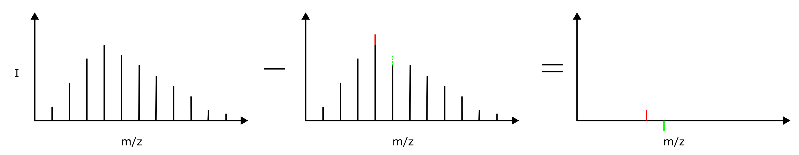

## Overview

Metal clusters exhibit unique properties due to their size, structure and elemental composition. These factors provide clusters with a wide degree of tunability with respect to their electronic properties and extension afford them the facility to catalyse important reactions (CO2 reduction, H2>O splitting) in heterogeneous catalysis. In practice, these clusters are often studied in the gas phase whereby any interactions with a substrate are removed and focus on the activation of molecules bound to the clusters is examined by laser spectroscopy. In most cases, the density of species that is being studied is low (~10,000 or fewer) and so rather than record spectra via the absorbtion of light, some process (photofragmentation, photoionisation) is monitored using highly sensitive mass spectrometry to detect a light driven effect. This is collectively known as 'action spectroscopy'.

<figure style="max-width: 100%; margin: 20px auto; display: block;">
  
  <figcaption style="text-align: center; font-style: italic; margin-top: 5px;">
    Illustration of action spectroscopy with the laser-off mass spectrum (left), laser-on mass spectrum (centre) and difference spectrum (right).
  </figcaption>
</figure>

## Current Scope

In our current work the group again turns our focus upwards to extraterrestrial chemistry. While metal clusters exhibit useful industrial catalytic activation, we are interested in their role and the role of grains and surfaces as sites for astrochemical reactions. However, while the context may be different, the methods remain the same.

For these experiments, the group travels to the [HFML-FELIX free-electron laser](https://hfml-felix.com/) in Nijmegen, Netherlands to work alongside Dr. Joost Bakker and members of Peter's former group from the University of Oxford. There we utilise the combined laser vaporisation molecular beam experiment to generate metal clusters and bind small molecules to them, and the bright and tunable light of FELIX in the FELICE intracavity experiment to photofragment the generated clusters. By tuning the wavelength of FELICE, resonant (and in some cases non-resonant) infrared features are revealed which we can compare with spectra predicted by electronic structure methods.

In the coming years, the group hopes to build additional instrumentation housed at Curtin University to study the kinetics of some of these reactions to complement the spectral data obtained at FELIX. Currently, preliminary work includes the deployment of new compuational methods on the [Setonix high-performanace computing cluster](https://pawsey.org.au/systems/setonix/) lead by [Max Davidson](https://watsonlaserlab.com/author/max-l.-davidson/).

## Collaborators

- [A/Prof. Joost Bakker](https://www.ru.nl/en/people/bakker-j)
- [Dr. Christian Haakansson](https://scholar.google.com/citations?user=ndUR9BkAAAAJ&hl=en)
- [Prof. Stuart Mackenzie](https://mackenzie.web.ox.ac.uk/)
- [A/Prof. Dino Spagnoli](https://research-repository.uwa.edu.au/en/persons/dino-spagnoli)
- [Dr. Max Davidson](https://watsonlaserlab.com/author/max-l.-davidson/)

## Contact

For more info, contact [peter@watsonlaserlab.com](mailto:peter@watsonlaserlab.com).