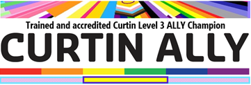

# Our Research Values

Our research group is built on a foundation of core values that guide every aspect of our work, from daily interactions to long-term research goals.

## Innovation, Curiosity & Excellence

We believe the best way to do science is to be inquisitive and humble. We accept that we won't get things right all the time but will keep asking questions and learning along the way.

We push ourselves to be creative and find new solutions to problems with fresh perspectives, questioning assumptions, and being willing to explore unconventional solutions.

We hold ourselves to high standards. We are exacting in our pursuit of research excellence and want to be proud of the work we produce.

## Collaboration & Collegiality

We work with others, and understand that the best science is done by teams. We acknowledge our strengths and try to recognise them in others to give them the opportunity to be their best.

We like to say yes. When new opportunities to work with other researchers or groups present themselves, we try to find ways where we can contribute or bring to bear our skills or knowledge to new problems.

We try to be good colleagues - inside and outside the lab. We share resources and lend a hand where we can. We don't want to be a barrier to others' success and will help them to get there if we can.

## Honesty, Respect & Inclusivity

We believe kindness and success in academia and research are not mutually exclusive ideas. We treat everyone we encounter with respect and acknowledge the unique paths that people have taken to get to where we meet them. This is non-negotiable. We would rather fail in the right way, than succeed but compromise along the way.

We believe in honesty and owning our mistakes. This is the best way to learn and identify where we can grow. There's no point hiding our mistakes and simply kicking the can down the road only to make them again when more is at stake. We present ourselves truthfully when dealing with others. If we disagree, we're open about why and try and find compromise and resolution.

We believe in meeting people where they are at. For all our talk about success in science and the pursuit of excellence. This comes second to people's wellbeing and safety. We know that what happens outside the lab has no bearing on a person's potential for success and we try and accommodate them as best we can. If someone is struggling or having a hard time, we try and provide support as a team and let them focus on what's more important than science.

We acknowledge the traditional owners of the land on which we live and work the [Whadjuk people of the Noongar nation](https://www.noongarculture.org.au/whadjuk/) and pay our respects to Elders past and present. We're deeply blessed to be able to call Boorloo (Perth) our home and grateful to the custodianship that the First Nations peoples have taken of the land for generations. We acknowledge First Nations peoples as Australia's first scientists and astronomers, and their immense knowledge of country and the skys above. 

We know that everyone is unique in who they are, how they feel about themselves and who they love. Our passion for science is built in that is accepts all and so do we. We passionately believe that the best ideas can only come when people feel safe and accepted in their work and we do what we can to foster that environment. We believe strongly in a principle of 'passing the mic', in protecting spaces so that others may speak for themselves.

  
  
Peter has completed Level 3 Curtin Ally training and is an available touchpoint for DSSG students in WASM:MECE.

## Safety & Responsibility

We beleive that everyone deserves to go home safe. We regularly work with equipment or chemicals that can cause harm if not treated with respect. But with proper training and a clear mindset they are invaluable tools in our pursuit of knowledge.

We acknowledge the impact that science, and particularly chemistry, has had in impacting the world and environment around us. We strive to be conscientious and mindful of the impact not only of our work, but of our practices. Many of the problems we tackle are seeking to contribute to achieving [Real Zero](https://realzero.earth/) in the fight against climate change, and we acknowledge that climate action begins with us. We aim to enact the [Principles of Green Chemistry](https://www.acs.org/green-chemistry-sustainability/principles/12-principles-of-green-chemistry.html) in our practice and reduce emissions, energy usage and waste resulting from our work.

## Living Our Values

These values are not just aspirational statements – they guide our daily decisions and long-term strategy. They influence how we select research projects, how we collaborate with partners, and how we contribute to the broader scientific community.

We regularly reflect on these values and how well we're living up to them, using them as a compass for continuous improvement in all aspects of our work.

---
